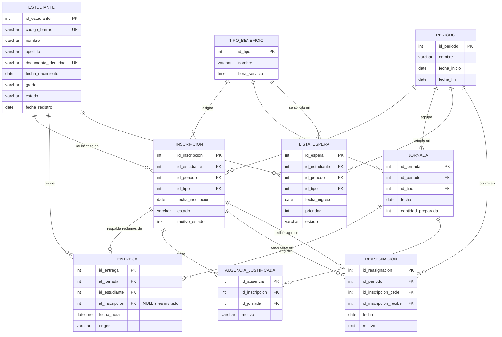

# 🍽️ Diseño de base de datos — Sistema de beneficios alimentarios (PAE escolar)

> Caso de estudio: una escuela pública entrega a estudiantes de bajos recursos uno de dos
> beneficios: **refrigerio** (mañana) o **almuerzo** (medio día). Los alimentos se preparan según
> los inscritos, pero cuando no son reclamados se invitan a estudiantes no inscritos para no
> perderlos. Se necesita una aplicación que: (1) verifique con **lectura de código de barras**
> que el inscrito reclama su beneficio, (2) detecte **inscritos que no usan** el cupo para
> reasignarlo, y (3) registre **no inscritos frecuentes** para asignarles un cupo cuando sea posible.

---

## 1. Otra información relevante que surgiría

### 1.1 Lo que el sistema puede descubrir (valor de los datos)

| Información | Cómo surge | Para qué sirve |
|---|---|---|
| **Desperdicio real por jornada** | `cantidad_preparada − entregas` | Ajustar la producción diaria y reducir sobrantes |
| **Horas pico de reclamo** | `fecha_hora` de las entregas | Logística de filas y puntos de entrega |
| **Alerta temprana de deserción** | Inscrito que deja de reclamar varias semanas | El comedor es un *sensor* de inasistencia/deserción; permite intervención temprana |
| **Préstamo de carnet / doble reclamo** | Cruzar reclamos con asistencia a clases | Detectar carnets prestados y uso irregular |
| **Patrones por grado y día** | Entregas agrupadas por grado/jornada | Saber qué días/grados generan más sobrante |

### 1.2 Lo que la escuela debe definir antes (políticas, no datos)

- **Umbral de reasignación**: ¿cuántos días sin reclamar (injustificados) suspenden un cupo?
  ¿Hay ventana de gracia antes de reasignar?
- **Ausencias justificadas** (enfermedad, representación deportiva o académica): un día
  justificado NO debe contar contra el estudiante → de ahí nace la tabla `ausencia_justificada`.
- **Criterio de prioridad** en la lista de espera: condición socioeconómica (SISBEN), hermanos
  ya inscritos, frecuencia histórica de reclamo.
- **Doble beneficio**: ¿puede un inscrito en refrigerio ser invitado al almuerzo el mismo día?

### 1.3 De gobernanza de datos

- Los estudiantes son **menores de edad**: aplica Habeas Data (Ley 1581/2012 en Colombia) —
  hay que definir quién puede consultar los reportes y con qué propósito.
- **Carnets perdidos y reemitidos** (cambia el código de barras) y estudiantes **retirados**
  (liberan cupo) o **ingresados a mitad de periodo** (necesitan cupo).
- **Auditoría**: qué operador autorizó cada invitación a un no inscrito (evita favores indebidos).

---

## 2. Supuestos del diseño

1. Todos los estudiantes del colegio (inscritos o no) tienen carnet con código de barras
   **único** — clave para el requisito 3: también los invitados se escanean.
2. Un estudiante inscrito tiene **un solo tipo de beneficio por periodo**; cambiar de tipo
   equivale a actualizar su inscripción.
3. La unidad de reparto es la **jornada**: (fecha, tipo de beneficio); la cantidad preparada
   se registra por jornada.
4. El escáner es el **único canal** de registro de reclamos (si hay entregas "de palabra",
   las métricas de uso quedan incompletas y dejan de ser confiables).

---

## 3. Tablas

| Tabla | Propósito | Atributos clave |
|---|---|---|
| `estudiante` | **Todos** los estudiantes del colegio (la inscripción es un estado aparte) | `id_estudiante` PK, `codigo_barras` **UNIQUE NOT NULL**, nombre, apellido, documento, `grado`, `estado` (ACTIVO / RETIRADO / GRADUADO) |
| `tipo_beneficio` | Catálogo: REFRIGERIO / ALMUERZO | `id_tipo` PK, `nombre`, `hora_servicio` |
| `periodo` | Vigencia (año escolar) — inscribe y mide por periodos | `id_periodo` PK, `nombre`, `fecha_inicio`, `fecha_fin` |
| `inscripcion` | El **cupo**: estudiante + periodo + un beneficio | `id_inscripcion` PK, 3 FKs, `fecha_inscripcion`, `estado` (ACTIVO / **SUSPENDIDO** / **REASIGNADO** / RETIRADO), `motivo_estado`. UNIQUE(estudiante, periodo) |
| `jornada` | Cada servicio ofrecido: (fecha, tipo) | `id_jornada` PK, `fecha`, `id_tipo` FK, `id_periodo` FK, `cantidad_preparada`. UNIQUE(fecha, tipo) |
| `entrega` | **El corazón**: cada reclamo real, escaneado | `id_entrega` PK, `id_jornada` FK, `id_estudiante` FK, `id_inscripcion` FK **NULLABLE** (NULL = invitado no inscrito), `fecha_hora`, `origen` (INSCRITO / INVITADO). **UNIQUE(jornada, estudiante)** → nadie reclama dos veces el mismo beneficio el mismo día |
| `ausencia_justificada` | Evita castigar al que faltó con razón | `id_ausencia` PK, `id_inscripcion` FK, `id_jornada` FK, `motivo`. UNIQUE(inscripción, jornada) |
| `lista_espera` | Frecuentes no inscritos → candidatos a cupo nuevo | `id_espera` PK, FK estudiante/periodo/tipo deseado, `fecha_ingreso`, `prioridad`, `estado` (EN_ESPERA / ASIGNADO / DESCARTADO) |
| `reasignacion` | Auditoría del movimiento de cupos | `id_reasignacion` PK, `id_inscripcion_cede` FK (cupo quitado), `id_inscripcion_recibe` FK NULL (cupo dado), `fecha`, `motivo` |

**Relaciones importantes:**

- `inscripcion → entrega` es **1 a 0..N con FK nullable** — esa nullableidad es la que
  distingue "reclamo de inscrito" (verificado por carnet, requisito 1) de "invitado con
  sobrante" (requisito 3).
- `jornada` es el eje temporal: todas las métricas de uso se calculan contra ella.
- `reasignacion` conecta dos inscripciones: la que libera el cupo y la que lo recibe.

---

## 4. Diagrama Entidad–Relación (Mermaid)



---

## 5. Consultas que resuelven los tres requisitos

### R1 · Al escanear un carnet: ¿tiene cupo activo en el beneficio de hoy?

```sql
SELECT i.id_inscripcion, e.nombre
FROM estudiante e
JOIN inscripcion i ON i.id_estudiante = e.id_estudiante
WHERE e.codigo_barras = :codigo
  AND i.estado = 'ACTIVO'
  AND i.id_periodo = :periodo
  AND i.id_tipo = :tipo_de_hoy;
-- Devuelve fila  → registrar entrega con origen INSCRITO (requisito 1 cumplido)
-- No devuelve fila → si hay sobrantes, registrar entrega con id_inscripcion NULL, origen INVITADO
```

### R2 · Inscritos que no usan el beneficio (candidatos a reasignar su cupo)

```sql
SELECT e.nombre, e.apellido, COUNT(*) AS dias_sin_reclamar
FROM inscripcion i
JOIN estudiante e ON e.id_estudiante = i.id_estudiante
JOIN jornada j ON j.id_periodo = i.id_periodo AND j.id_tipo = i.id_tipo
LEFT JOIN entrega t ON t.id_jornada = j.id_jornada AND t.id_inscripcion = i.id_inscripcion
LEFT JOIN ausencia_justificada a ON a.id_inscripcion = i.id_inscripcion AND a.id_jornada = j.id_jornada
WHERE i.estado = 'ACTIVO'
  AND t.id_entrega IS NULL
  AND a.id_ausencia IS NULL
GROUP BY i.id_inscripcion, e.nombre, e.apellido
HAVING COUNT(*) >= 10;   -- umbral definido por la política escolar
```

### R3 · No inscritos frecuentes (candidatos a un cupo nuevo)

```sql
SELECT e.nombre, e.apellido, COUNT(*) AS veces_invitado
FROM entrega t
JOIN estudiante e ON e.id_estudiante = t.id_estudiante
JOIN jornada j ON j.id_jornada = t.id_jornada
WHERE t.id_inscripcion IS NULL
  AND j.id_periodo = :periodo
GROUP BY e.id_estudiante, e.nombre, e.apellido
HAVING COUNT(*) >= 5
ORDER BY veces_invitado DESC;
```

### Sobrantes del día

```
sobrantes = jornada.cantidad_preparada − COUNT(entregas de esa jornada)
```

---

## 6. Extensiones naturales (no incluidas para mantener el diseño enseñable)

- **`carnet`**: historial de códigos reemitidos por pérdida (un estudiante puede tener varios
  carnets a lo largo del tiempo; el activo es el último).
- **`operador`** + auditoría de invitaciones autorizadas (quién dejó pasar a cada invitado).
- **`curso`**: separar curso/grupo del estudiante para reportes agregados.
- **`menu` / `alergias`**: si el colegio quiere controlar qué menú recibe cada estudiante.